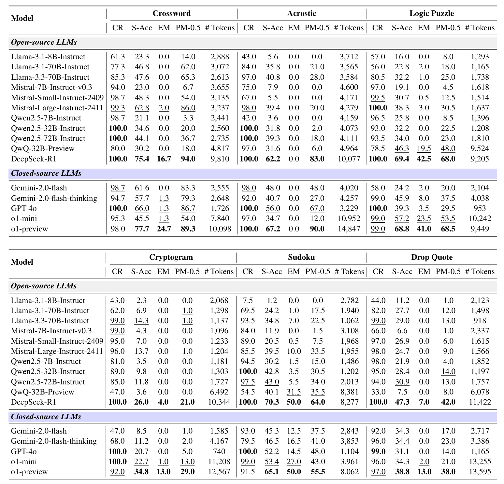

# LR<sup>2</sup>Bench: Evaluating Long-chain Reflective Reasoning Capabilities of Large Language Models via Constraint Satisfaction Problems
<p align="center">
    📖 <a href="https://arxiv.org/abs/2502.17848" target="_blank">Paper</a> • 🤗 <a href="https://huggingface.co/spaces/UltraRonin/LR2Bench" target="_blank">Leaderboard</a>
</p>


## 🔍 Table of Contents
- [🌐 Overview](#overview)
- [💡 Generation](#generation)
- [📊 Evaluation](#evaluation)
- [📝 Citation](#citation)


<a name="overview"></a>

## 🌐 Overview


Recent progress in Large Reasoning Models (LRMs) has significantly enhanced the reasoning abilities of Large Language Models (LLMs), empowering them to tackle increasingly complex tasks through reflection capabilities, such as making assumptions, backtracking, and self-refinement. However, effectively evaluating such reflection capabilities remains challenging due to the lack of appropriate benchmarks. To bridge this gap, we introduce LR<sup>2</sup>Bench, a novel benchmark designed to evaluate the **L**ong-chain **R**eflective **R**easoning capabilities of LLMs. LR<sup>2</sup>Bench comprises 850 samples across six Constraint Satisfaction Problems (CSPs) where reflective reasoning is crucial for deriving solutions that meet all given constraints. Each type of task focuses on distinct constraint patterns, such as knowledge-based, logical, and spatial constraints, providing a comprehensive evaluation of diverse problem-solving scenarios. Our extensive evaluation on both conventional LLMs and LRMs reveals that even the most advanced LRMs, such as DeepSeek-R1 and OpenAI o1-preview, struggle with tasks in LR<sup>2</sup>Bench, achieving an average Exact Match score of only 20.0% and 23.6%, respectively. These findings underscore the significant room for improvement in the reflective reasoning capabilities of current LLMs.




<a name="generation"></a>

## 💡 Generation
You can edit the tasks and models for generation in `launch.sh`. This script including both model generation and answer extraction.
```bash
bash launch.sh
```


<a name="evaluation"></a>

## 📊 Evaluation
Then run the `merge.sh` to get the overall performance of your model in folder `./submission`.
```bash
bash merge.sh
```

<a name="citation"></a>

## 📝 Citation

If you find this repo useful for your research, please consider citing the paper:
```
@article{chen2025lr,
  title={LR $\^{} 2$ Bench: Evaluating Long-chain Reflective Reasoning Capabilities of Large Language Models via Constraint Satisfaction Problems},
  author={Chen, Jianghao and Wei, Zhenlin and Ren, Zhenjiang and Li, Ziyong and Zhang, Jiajun},
  journal={arXiv preprint arXiv:2502.17848},
  year={2025}
}
```